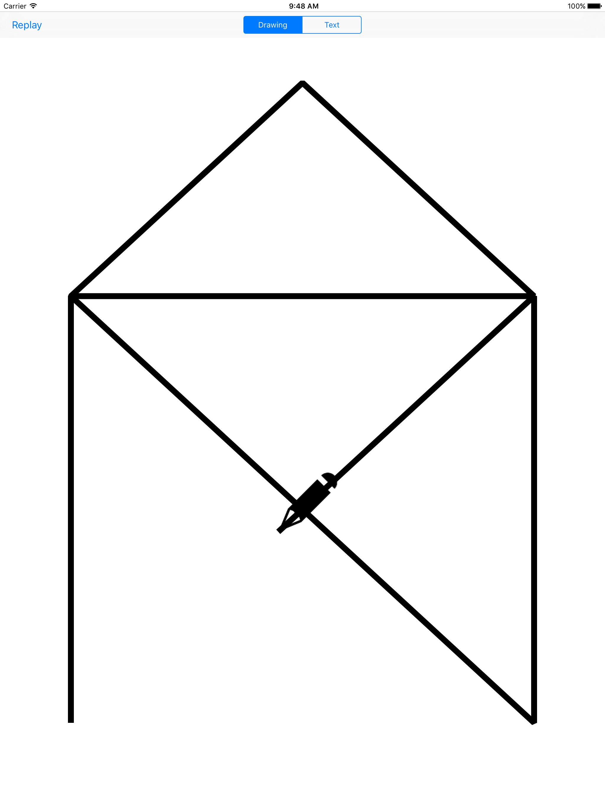

# AnimatedPaths

Animating the drawing of a CGPath with the help of CAShapeLayer.strokeEnd.

The  Objective-C  Version is [here](https://github.com/ole/Animated-Paths).

Drawing Path:

Drawing Text:

